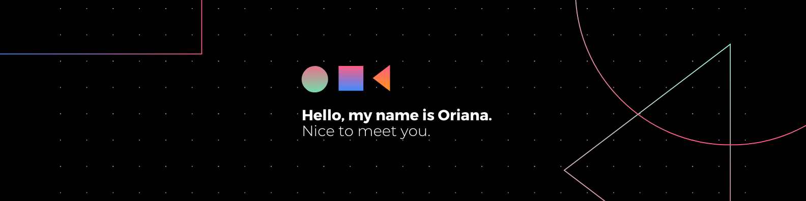

   <kbd></kbd>

# 💫 About Me:
👋 Hi, I’m Oriana  👀 I’m interested in programming and cybersecurity  🌱 I’m currently learning Backend Development & DataBase advanced  💞️ I’m looking to collaborate on Responsive web design  👩‍💻 Functional Analyst - UX/UI Designer 💜✨  👩‍🏫 Tutor of Data processing on Microsoft Excel and Business Analytics at Coderhouse     

## 🌐 Socials:
   

# 💻 Tech Stack:
                                	            

# 📊 GitHub Stats:
 
 

### ✍️ Random Dev Quote

--- 

<!-- Proudly created with GPRM ( https://gprm.itsvg.in ) -->
